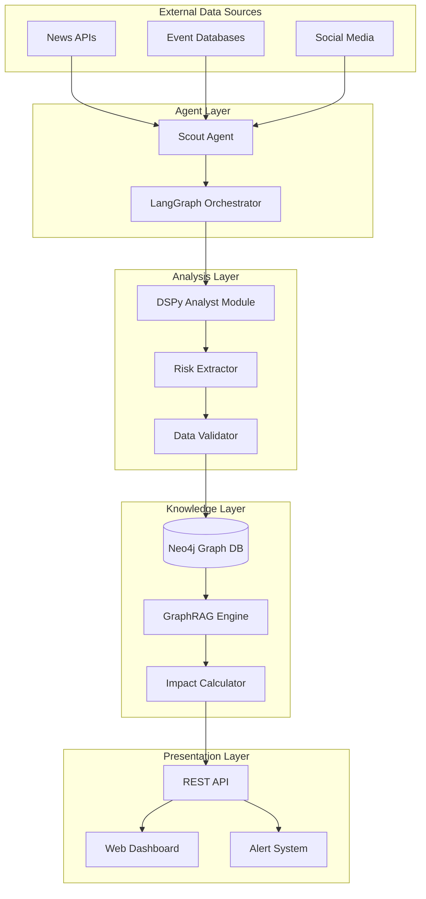

# ChainReaction Design Document

## Overview

ChainReaction is an autonomous supply chain risk monitoring system that combines agentic AI, graph databases, and optimized language models to provide real-time supply chain intelligence. The system maintains a knowledge graph of supply chain relationships and continuously monitors global events to calculate downstream impacts on business operations.

The architecture follows a three-layer approach: autonomous data collection through Scout Agents, intelligent analysis via DSPy-optimized modules, and graph-based impact assessment using Neo4j and GraphRAG techniques.

## Architecture

### High-Level Architecture



### Component Architecture

The system uses a microservices architecture with the following core components:

1. **Agent Orchestration Service** (LangGraph): Manages the workflow between Scout Agents and analysis modules
2. **Data Collection Service** (Scout Agents): Autonomous browsing and data gathering from external sources
3. **Analysis Service** (DSPy Modules): Structured extraction and validation of risk information
4. **Graph Service** (Neo4j + GraphRAG): Knowledge graph management and relationship analysis
5. **API Service** (FastAPI): REST endpoints and webhook management
6. **Frontend Service** (Next.js): Interactive dashboard and visualization

## Components and Interfaces

### Scout Agent

**Purpose**: Autonomous discovery of supply chain disruption events from global information sources.

**Key Responsibilities**:
- Continuous monitoring of news APIs (Tavily, NewsAPI)
- Event database scanning (GDELT Project integration)
- Search query optimization for supply chain-related events
- Rate limiting and API quota management

**Interface**:
```python
class ScoutAgent:
    async def search_disruptions(self, regions: List[str], timeframe: str) -> List[RawEvent]
    async def monitor_continuous(self, callback: Callable) -> None
    def configure_sources(self, sources: Dict[str, SourceConfig]) -> None
```

### DSPy Analyst Module

**Purpose**: Reliable extraction of structured risk data from unstructured news content using optimized prompts.

**Key Responsibilities**:
- News article content analysis
- Entity extraction (companies, locations, event types)
- Severity assessment and confidence scoring
- Prompt optimization through DSPy compilation

**Interface**:
```python
class RiskAnalyst(dspy.Module):
    def __init__(self):
        self.extractor = dspy.ChainOfThought(RiskExtractor)
        
    def forward(self, news_content: str) -> RiskEvent
    def compile_with_examples(self, training_data: List[Example]) -> None
```

**DSPy Signature**:
```python
class RiskExtractor(dspy.Signature):
    """Extract structured supply chain risk information from news content."""
    news_content = dspy.InputField()
    location = dspy.OutputField(desc="Geographic location of the event")
    company = dspy.OutputField(desc="Affected company or organization")
    event_type = dspy.OutputField(desc="Type of disruption: Strike, Weather, Bankruptcy, Geopolitical, Other")
    severity = dspy.OutputField(desc="Impact severity: Low, Medium, High, Critical")
    confidence = dspy.OutputField(desc="Extraction confidence: 0.0-1.0")
```

### GraphRAG Engine

**Purpose**: Contextual reasoning over supply chain relationships using graph-augmented retrieval.

**Key Responsibilities**:
- Neo4j query generation and execution
- Relationship traversal for impact analysis
- Context-aware response generation
- Graph embedding and similarity search

**Interface**:
```python
class GraphRAGEngine:
    async def find_impact_path(self, risk_event: RiskEvent) -> List[ImpactPath]
    async def query_relationships(self, entity: str, relationship_type: str) -> List[GraphNode]
    def generate_contextual_response(self, query: str, graph_context: GraphContext) -> str
```

### LangGraph Orchestrator

**Purpose**: State management and workflow coordination between autonomous agents and analysis modules.

**Workflow States**:
1. **Monitor**: Continuous scanning for new events
2. **Extract**: DSPy-based analysis of discovered content
3. **Validate**: Data quality checks and confidence assessment
4. **Analyze**: Graph-based impact calculation
5. **Alert**: Notification generation for significant risks

**State Transitions**:
```python
workflow = StateGraph(AgentState)
workflow.add_node("monitor", scout_agent_node)
workflow.add_node("extract", analyst_node)
workflow.add_node("validate", validation_node)
workflow.add_node("analyze", graph_analysis_node)
workflow.add_node("alert", notification_node)

workflow.add_edge("monitor", "extract")
workflow.add_conditional_edges("extract", should_validate, {"valid": "validate", "invalid": "monitor"})
workflow.add_edge("validate", "analyze")
workflow.add_conditional_edges("analyze", should_alert, {"alert": "alert", "continue": "monitor"})
```

## Data Models

### Core Graph Schema

**Nodes**:
```python
class Supplier(BaseNode):
    id: str
    name: str
    location: str
    risk_score: float
    contact_info: Optional[Dict]
    
class Component(BaseNode):
    id: str
    name: str
    category: str
    specifications: Dict
    
class Product(BaseNode):
    id: str
    name: str
    product_line: str
    revenue_impact: float
    
class Location(BaseNode):
    id: str
    name: str
    country: str
    region: str
    risk_factors: List[str]
```

**Relationships**:
```python
class SupplierRelationship(BaseRelationship):
    SUPPLIES = "SUPPLIES"
    LOCATED_IN = "LOCATED_IN"
    BACKUP_FOR = "BACKUP_FOR"
    
class ProductRelationship(BaseRelationship):
    PART_OF = "PART_OF"
    REQUIRES = "REQUIRES"
    ALTERNATIVE_TO = "ALTERNATIVE_TO"
```

### Risk Event Model

```python
class RiskEvent(BaseModel):
    id: str
    event_type: EventType
    location: str
    affected_entities: List[str]
    severity: SeverityLevel
    confidence: float
    source_url: str
    detected_at: datetime
    estimated_duration: Optional[timedelta]
    
class ImpactAssessment(BaseModel):
    risk_event_id: str
    affected_products: List[str]
    impact_paths: List[ImpactPath]
    severity_score: float
    estimated_timeline: Dict[str, datetime]
    mitigation_options: List[str]
```

### Agent State Model

```python
class AgentState(TypedDict):
    current_events: List[RawEvent]
    extracted_risks: List[RiskEvent]
    validated_risks: List[RiskEvent]
    impact_assessments: List[ImpactAssessment]
    alerts_generated: List[Alert]
    processing_errors: List[ProcessingError]
```

## Correctness Properties

*A property is a characteristic or behavior that should hold true across all valid executions of a system—essentially, a formal statement about what the system should do. Properties serve as the bridge between human-readable specifications and machine-verifiable correctness guarantees.*
### Property Reflection

After reviewing all properties identified in the prework analysis, I've identified several areas for consolidation:

**Redundancy Elimination:**
- Properties 2.2 and 2.3 both test extraction pipeline behavior and can be combined into a comprehensive extraction property
- Properties 3.1, 3.2, and 3.3 all test graph data integrity and can be consolidated into a single graph consistency property  
- Properties 5.1, 5.2, and 5.3 all test DSPy extraction behavior and can be combined into one comprehensive extraction property
- Properties 6.1 and 6.2 both test graph traversal for impact analysis and can be unified

**Consolidated Properties:**
The following properties provide unique validation value after removing redundancy:

1. **Graph Traversal Completeness** (combines 1.1, 6.1, 6.2)
2. **Risk Prioritization** (1.3)  
3. **Alert Generation** (1.5)
4. **Search Coverage** (2.1)
5. **Extraction Pipeline** (combines 2.2, 2.3, 5.1, 5.2, 5.3)
6. **Error Handling Continuity** (2.4)
7. **Multi-Source Search** (2.5)
8. **Graph Data Integrity** (combines 3.1, 3.2, 3.3)
9. **JSON Import** (3.4)
10. **Visual Risk Highlighting** (4.2)
11. **Node Interaction** (4.3)
12. **Query Visualization** (4.5)
13. **Redundancy Assessment** (6.3)
14. **Impact Scoring** (6.4)
15. **Report Completeness** (6.5)
16. **API Response Format** (7.2)
17. **Authentication Enforcement** (7.4)

### Correctness Properties

Property 1: Graph traversal completeness
*For any* product in the knowledge graph, querying its supply chain risks should return all upstream suppliers, components, and locations connected through any relationship path
**Validates: Requirements 1.1, 6.1, 6.2**

Property 2: Risk prioritization consistency  
*For any* set of risk events affecting the same product, the system should order results by severity level first, then by timeline, maintaining consistent ordering across identical inputs
**Validates: Requirements 1.3**

Property 3: Alert generation for monitored products
*For any* product with monitoring enabled, when a new risk event affects its supply chain, the system should generate an alert within the monitoring cycle
**Validates: Requirements 1.5**

Property 4: Comprehensive search coverage
*For any* search operation, the Scout Agent should include queries for all specified disruption types: strikes, weather events, bankruptcies, and geopolitical incidents
**Validates: Requirements 2.1**

Property 5: Extraction pipeline completeness
*For any* news content processed by the system, the Analyst Module should extract location, affected entities, event type, and severity level with consistent structure
**Validates: Requirements 2.2, 2.3, 5.1, 5.2, 5.3**

Property 6: Error handling continuity
*For any* extraction failure on malformed input, the system should log the error and continue processing remaining sources without stopping the pipeline
**Validates: Requirements 2.4**

Property 7: Multi-source search execution
*For any* search operation, the Scout Agent should query all configured information sources including news APIs and event databases
**Validates: Requirements 2.5**

Property 8: Graph data integrity preservation
*For any* modification to the knowledge graph (adding entities, updating relationships), all existing connections should remain valid and no orphaned nodes should be created
**Validates: Requirements 3.1, 3.2, 3.3**

Property 9: JSON import round-trip consistency
*For any* valid supply chain JSON data, importing then exporting should preserve all entities and relationships without data loss
**Validates: Requirements 3.4**

Property 10: Visual risk highlighting accuracy
*For any* detected risk event, affected nodes should be highlighted in red and at-risk products should be highlighted in orange in the graph visualization
**Validates: Requirements 4.2**

Property 11: Node interaction information completeness
*For any* graph node selection, the system should display all available entity information including name, type, relationships, and current risk status
**Validates: Requirements 4.3**

Property 12: Query result visualization synchronization
*For any* query result, the graph visualization should update to highlight all relevant paths and relationships mentioned in the response
**Validates: Requirements 4.5**

Property 13: Redundancy assessment accuracy
*For any* component with multiple suppliers, the Risk Assessor should identify all alternative sourcing options and calculate redundancy levels correctly
**Validates: Requirements 6.3**

Property 14: Impact scoring consistency
*For any* supply chain configuration, impact severity scores should be calculated consistently based on relationship criticality and supplier concentration metrics
**Validates: Requirements 6.4**

Property 15: Impact report completeness
*For any* generated impact report, timeline estimates should be included for all identified potential disruptions
**Validates: Requirements 6.5**

Property 16: API response format standardization
*For any* API request, responses should conform to standardized JSON schema with consistent field names and data types
**Validates: Requirements 7.2**

Property 17: Authentication enforcement universality
*For any* API request, the system should validate credentials and enforce access controls before processing the request
**Validates: Requirements 7.4**

## Error Handling

### Error Categories

**Data Collection Errors**:
- API rate limiting and quota exhaustion
- Network connectivity failures
- Malformed or incomplete news content
- Source unavailability or timeouts

**Analysis Errors**:
- DSPy extraction failures on ambiguous content
- Confidence threshold violations
- Entity resolution conflicts
- Language processing limitations

**Graph Errors**:
- Neo4j connection failures
- Cypher query syntax errors
- Relationship constraint violations
- Graph traversal timeouts

**System Errors**:
- LangGraph state management failures
- Agent coordination timeouts
- Memory and resource constraints
- Configuration validation errors

### Error Handling Strategies

**Graceful Degradation**:
- Continue processing with reduced functionality when non-critical components fail
- Maintain core risk assessment capabilities even with limited data sources
- Provide partial results with confidence indicators when full analysis is unavailable

**Retry Mechanisms**:
- Exponential backoff for transient API failures
- Circuit breaker pattern for consistently failing services
- Alternative source fallback for data collection failures

**Error Recovery**:
- Automatic DSPy recompilation when extraction accuracy drops
- Graph consistency repair for relationship violations
- State recovery mechanisms for agent workflow interruptions

## Testing Strategy

### Dual Testing Approach

ChainReaction requires both unit testing and property-based testing to ensure comprehensive correctness validation:

**Unit Testing Focus**:
- Specific examples of risk event processing
- Edge cases like empty graphs or malformed inputs
- Integration points between Scout Agents and Analysis modules
- API endpoint functionality and error responses
- Dashboard component rendering and interaction

**Property-Based Testing Focus**:
- Universal properties that should hold across all supply chain configurations
- Graph traversal correctness for arbitrary network topologies
- Extraction consistency across diverse news content formats
- Impact calculation accuracy for various risk scenarios
- System behavior under random input combinations

### Property-Based Testing Implementation

**Testing Framework**: Hypothesis (Python) for property-based test generation
**Minimum Iterations**: 100 test cases per property to ensure statistical confidence
**Property Tagging**: Each property-based test must include a comment with the format:
`# Feature: chain-reaction, Property {number}: {property_text}`

**Test Generators**:
- Supply chain graph generator with configurable complexity
- News article generator with varied formats and content
- Risk event generator covering all disruption types
- API request generator for endpoint testing

**Property Test Requirements**:
- Each correctness property must be implemented by exactly one property-based test
- Tests should run without mocking to validate real functionality
- Generators should intelligently constrain inputs to valid domains
- Property violations should provide clear counterexamples for debugging

### Integration Testing

**End-to-End Workflows**:
- Complete risk detection pipeline from news ingestion to alert generation
- Graph update workflows with real-time visualization updates
- Multi-agent coordination under various load conditions
- API integration with external systems

**Performance Testing**:
- Graph query performance with large datasets (up to 50,000 nodes)
- Concurrent user load testing for dashboard and API
- Memory usage patterns during continuous monitoring
- Agent response times under high event volumes

### Test Data Management

**Synthetic Data Generation**:
- Realistic supply chain graphs with configurable complexity
- Diverse news article corpus covering all event types
- Historical event data for training DSPy modules
- Performance test datasets with known characteristics

**Test Environment**:
- Containerized Neo4j instances for isolated testing
- Mock external APIs with configurable failure modes
- Staging environment mirroring production architecture
- Automated test data refresh and cleanup procedures